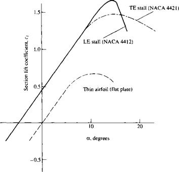

# Лабораторна робота №1
##  Дослідження базових властивостей гвинта

В авіації гвинти використовуються для створення аеродинамічних сил, що призводять до руху літальних апаратів. Головною задачею гвинта є створення тяги. В залежності від типу літального апарату гвинти можуть сворювати підйомну силу (гелікоптери, квадрокоптери) та забезпечувати поступальний рух (літаки, дирижаблі). Таким чином в авіації проблеми аеродинаміки гвинта є одним з ключових задач.

Теорія елементів лопаті гвинта (blade element theory) є одним з основних підходів для моделювання аеродинамічних характеристик гвинта. Ця теорія базується на розбитті лопаті гвинта на невеликі елементи, що називаються *елементами лопаті*. Кожен елемент лопаті розглядається окремо, і його аеродинамічні властивості, такі як кут нахилу, коефіцієнт підйому та опору, враховуються в обрахунках.

Ключовим поняттям в теорії елементів лопаті гвинта є *теорія потоку*. Вона використовується для опису поведінки повітряного потоку навколо гвинта. За допомогою цієї теорії можна визначити розподіл аеродинамічних сил, що діють на кожен елемент лопаті гвинта.

Основними завданями, що вирішуються за допомогою теорії елементів лопаті гвинта є визначення оптимальної форми та параметрів гвинта для досягнення максимальної тяги або ефективності. Це може бути досягнуто шляхом варіювання кута нахилу, довжини та форми лопаті гвинта.

Отож застосування теорії елементів лопаті гвинта дозволяє інженерам розробляти більш ефективні та економічні гвинти для різних застосувань. Вона допомагає визначити оптимальні параметри гвинта, що забезпечують найбільшу тягу при мінімальному споживанні енергії і є важливим кроком у розумінні принципів аеродинаміки та розробці ефективних гвинтів.

В данній лабораторній роботі  розглядаються основні принципи теорії елементів лопаті гвинта і їх застосування для розрахунку аеродинамічних характеристик гвинта та оцінки їх експлуатаційних можливостей.

## Завдання

1. Провести математичне моделювання тяги гвинта з різними кутами установки лопатей;

2. Визначити та порівнятизначення повітряної швидкості при якій забезпечується максимальна тяга та зробити висновок про призначення гвинта в залежності від кута установки лопатей;

3. Визначити максимальну досяжну повітряну швидкість, що може бути досягнута з заданими гвинтами;

4. Дослідити аеродинамічну тягу гвинтів при зміні висоти польоту (щільності повітря).

## Перелік файлів

`main_lab01.m` - основний файл

`cl_flat.m` - функція зміни коефіцієнту підйомної сили пласкої пластини

`propeller.m` - функція розрахунку тяги гвинта

## Питання для самоконтролю

1. Яку роль виконують гвинти в авіації.

2. Яким чином визначити призначення гвинта в залежності від його конструктивних характеристик

3. Як впливає базовий кут установки лопаті гвинта на його аеродинамічні характеристики

4. (*) Яку максимальну швидкість можна досягти при використанні повітряних гвинтів .

## Посилання

### Графік зміни підйомної сили в залежності від кута атаки

### Стисла теорія

1. [Стисла теорія гвинта (англ.) ](http://www.aerodynamics4students.com/propulsion/blade-element-propeller-theory.php)
